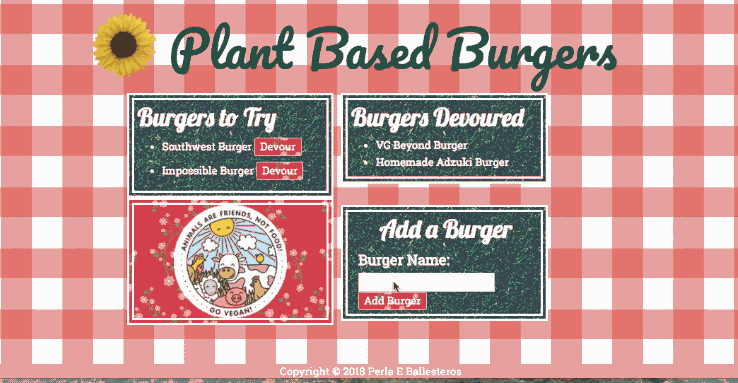

# burger
## By Perla E. Ballesteros

[Demo Version](https://protected-lake-39232.herokuapp.com/)

**Description:**
The Burger app allows the user to organize burgers into burgers devoured/burgers to try, add new burgers or update burgers which have been devoured. 

**Skills:**
Developer sharpens full-stack development skills when working with the burger app. Burger app employs the Node.js packages of express, mysql,and body-parser.Express is employed to create the app's server. MySQL is used to create a burgers database which is later updated through a JQuery AJAX request along with oject-relational mapping(orm), when the user either adds a burger or devours a burger. The app's complexity is addressed by employing model-view-controller(mvc) framework.

**Improvements:**
1. ADD LINKS OF MY FAVORITE RESTAURANTS
2. ADD ANOTHER INPUT FIELD FOR THE BURGERS RESTAURANT.